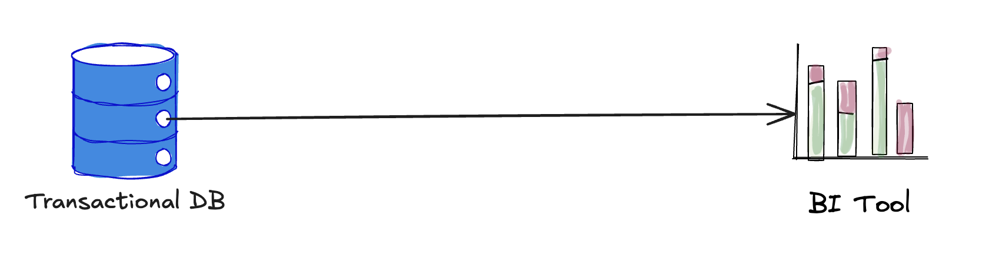
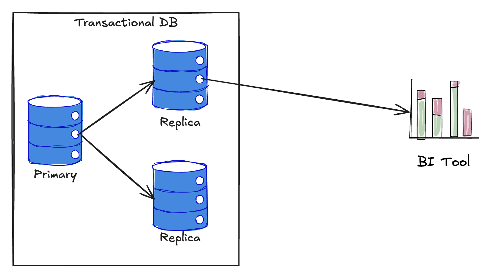

Many data engineering teams make the mistake of diving into building a complex, end-to-end pipeline without fully understanding how their work will drive value. This approach often results in long timelines before the business sees any tangible benefits. Instead, I argue for a different strategy: design the data stack with the end-user in mind — working backward from the tools they need to make decisions.

The goal? **Generate value quickly** by focusing on what delivers insights fastest, and only expand the complexity of your stack incrementally as your needs grow.

## The Story

Let’s imagine you’ve just been hired as the first data engineer at a rapidly growing e-commerce startup. The company is already doing well, but their data processes are still immature. They’re using PostgreSQL as the main database for their transactional operations — storing customer information, orders, product data, and more. 

Your first day on the job, the CTO pulls you aside and says:

> **We need to start tracking key metrics. The business team needs to see sales numbers, customer acquisitio trends, and product performance in real-time. Can you set something up fast?**
> 

With limited resources and time, you can’t afford to overcomplicate things. But you also know that the business needs reliable insights as soon as possible.

## Phase 1: Get the Business Running with Quick Wins

### Goal: Show Immediate Value

As the first data engineer, your goal is to show immediate value. You don’t need to worry about fancy distributed systems or elaborate storage solutions just yet. Instead of jumping straight into building an intricate data pipeline, you decide to take a pragmatic approach. Your first step is to get the business team the metrics they need **quickly**, without building unnecessary complexity.

### Setup: Transactional DB → BI Tool



You set up Superset (or Looker, Tableau, etc.) as a Business Intelligence (BI) tool and connect it directly to PostgreSQL. Now, the business team can immediately query the live database and start pulling insights on key metrics like:

- Daily and monthly sales
- Customer acquisition rate
- Product performance (best-sellers, stock levels, etc.)

This setup allows the company to start tracking its metrics in **just a few days**. There’s no need for an elaborate data pipeline or storage layers at this point. The focus is on speed to value.

### Impact: A Positive Response from the Business

With this simple approach, the business users are able to generate reports, track trends, and make data-driven decisions almost immediately. The CTO is thrilled. There’s no delay in seeing the impact of your work, and you’ve built trust with leadership by providing a quick win.

As the business grows and demands more sophisticated insights, you’ll be ready to incrementally expand the data stack. But for now, you’ve delivered what matters most — **actionable insights** — without unnecessary complexity.

## **Phase 1.5: Introducing Read-Replicas to Offload Query Load**

### Problem

As the business continues to grow and the frequency of data queries increases, you notice that **querying live data from PostgreSQL is starting to slow down the system**, impacting both the user experience and operational performance.

Your business teams still rely on Superset for reporting, but the heavy analytical queries are putting too much strain on the PostgreSQL database, which is also handling critical transactional workloads.

### Solution

Introduce **PostgreSQL read-replicas** to offload query load from the primary OLTP database.



### Setup

**PostgreSQL (Primary) → PostgreSQL (Read-Replica) → Superset**

#### **How It Works**:

- **Read-replicas** are copies of your primary PostgreSQL database that are kept in sync with the master.
- Queries are directed to the replica(s) instead of the primary database, which significantly reduces the load on the primary system.
- Business users can continue to generate reports using Superset, which now queries the replica without impacting the performance of the live transactional system.

#### **Why Use Read-Replicas?**

- **Immediate Relief for PostgreSQL**: Read-replicas ensure that the primary database remains performant by directing all analytics queries to the replica(s).
- **No Need for S3 Yet**: You can delay introducing S3 or any ingestion pipelines until your data volume grows significantly beyond what PostgreSQL can handle.
- **Smooth Transition**: This step provides a low-effort bridge between Phase 1 (direct BI queries) and Phase 2 (scalable storage and custom ingestion).

## Phase 2: Scale with Lightweight Engineering

### Goal: Handle Bottleneck

A few months pass, and the e-commerce business is growing fast. Sales are up, the customer base has doubled, and product inventory is expanding rapidly. But with this growth comes new challenges:

- Querying live data from PostgreSQL is starting to slow down the system.
- Some queries are becoming too heavy, and they’re affecting the performance of the application.
- The business team is now asking for more complex analyses, like trend forecasting, and historical reports spanning months of data.

The CTO comes to you again and says:

> **The metrics you set up were great at the start, but now the database is getting slow. We need a way to handle bigger data loads and make sure the reports don’t disrupt our core operations. What’s the next step?**
> 

### Setup: Scaling with a Simple Ingestion Layer

In Phase 2, you decide it’s time to introduce a simple ingestion layer and move some of the data out of PostgreSQL into a more scalable storage solution. You don’t need a full-blown data pipeline yet—just a basic way to offload historical and heavy-query data without putting a strain on the live database.

#### **Step 1: Introducing S3 as a Scalable Storage Solution**

You set up Amazon S3 to store larger datasets and historical records. S3 offers low-cost, durable, and scalable storage, which makes it ideal for offloading data that doesn’t need to be queried live from PostgreSQL.

#### **Step 2: Writing Simple Custom Ingestion Code**

Instead of introducing a complex orchestration tool like Airflow, you write some simple custom scripts to extract data from PostgreSQL and periodically move it into S3. These scripts might run as batch jobs, dumping historical sales data, customer activity logs, or inventory snapshots into S3 on a daily or weekly basis.

You could have the python script like this that:
1. Extracts data from PostgreSQL based on a date range.
2. Saves the extracted data as a CSV file.
3. Uploads the CSV file to an S3 bucket.
```python
# Fetch data from PostgreSQL
def fetch_data(creds, table, upsert_key, date_start, date_end):
    conn = get_db_connection(creds)
    df = None
    try:
        query = f"""
        SELECT * FROM {table}
        WHERE {upsert_key} >= '{date_start}' AND {upsert_key} <= '{date_end}';
        """
        df = pd.read_sql_query(query, conn)
    finally:
        conn.close()
    return df

# Upload CSV to S3
def upload_to_s3(creds, df, filename, public_name):
    csv_buffer = StringIO()
    df.to_csv(csv_buffer, index=False)

    s3_client = boto3.client("s3", region_name=creds["s3_region"])
    s3_client.put_object(
        Bucket=creds["s3_bucket"],
        Key=f"{public_name}/{filename}",
        Body=csv_buffer.getvalue()
    )
    print(f"✅ Uploaded {filename} to S3 bucket {creds['s3_bucket']} under {public_name}/")

# Main function
def main():
    parser = argparse.ArgumentParser(description="Extract data from PostgreSQL and upload to S3.")
    parser.add_argument("--creds_file", required=True, help="Path to YAML credentials file")
    parser.add_argument("--public_name", required=True, help="Public folder name in S3")
    parser.add_argument("--table", required=True, help="Table name in PostgreSQL")
    parser.add_argument("--upsert_key", required=True, help="Column used for date filtering")
    parser.add_argument("--date_start", required=True, help="Start date (YYYY-MM-DD)")
    parser.add_argument("--date_end", required=True, help="End date (YYYY-MM-DD)")
    
    args = parser.parse_args()
    creds = load_credentials(args.creds_file)

    filename = f"{args.table}_{args.date_start}_to_{args.date_end}.csv"
    
    df = fetch_data(creds, args.table, args.upsert_key, args.date_start, args.date_end)

    if not df.empty:
        upload_to_s3(creds, df, filename, args.public_name)
    else:
        print("⚠️ No data found for the given date range.")

if __name__ == "__main__":
    main()
```

And then, you can schedule the script to run automatically using crontab. Below is an example configuration to run the script daily at midnight:
```bash
0 0 * * * /usr/bin/python3 /path/to/script_name.py \
    --creds_file /path/to/creds.yaml \
    --public_name sales \
    --table sales_data \
    --upsert_key sale_date \
    --date_start $(date -d 'yesterday' +\%Y-\%m-\%d) \
    --date_end $(date -d 'yesterday' +\%Y-\%m-\%d) >> /var/log/data_pipeline.log 2>&1
```

#### **Step 3: Connecting S3 to Superset with Lightweight Query Engine**

Since Superset doesn’t natively connect to S3 files, you typically need to expose it as a table in a [database that Superset can connect to](https://superset.apache.org/docs/configuration/databases/). Here’s how you can do it:

### Impact: Bottleneck Solved

This lightweight ingestion solution immediately relieves pressure on PostgreSQL, improving application performance. The business team can now run complex reports and dig deeper into historical trends without worrying about slowing down the core system.

Your custom ingestion scripts are easy to maintain, and the additional layer of S3 storage allows you to start handling larger datasets as the company grows. And most importantly, you’ve done this without introducing unnecessary complexity, keeping engineering overhead low.

As the company continues to expand, you’ve now established the foundation for handling larger data volumes and scaling the data infrastructure. The CTO and business team see the value you’ve brought in with minimal engineering, keeping things simple while supporting the company's growth.

## Phase 3: Introducing Complexity Only When Necessary

### Setup: PostgreSQL → Spark (or another engine) → S3 → Superset

Fast forward another year. The e-commerce startup has exploded in growth. Your data is no longer just big—it’s massive. The company has expanded into new regions, launched multiple product lines, and has millions of customers. With this growth, your data challenges have scaled dramatically:

- Your PostgreSQL database can no longer handle the volume of live data, even with the historical data offloaded to S3.
- Your custom ingestion scripts are struggling to keep up with the increased frequency and volume of data.
- The business team is now asking for more complex insights: customer segmentation, real-time sales forecasting, advanced marketing analytics, and product recommendation engines.

The CTO comes to you one more time:

> **We need to handle much more data, and we’re reaching the limits of our current setup. The business needs more advanced analysis, but we’re hitting performance bottlenecks. What’s our next move?**
> 

## **Introducing Spark for Data Processing and Trino for Querying**

At this point, the need for a distributed processing engine and a more efficient query layer becomes clear. You decide to introduce **Apache Spark** for large-scale data processing and **Trino** (formerly Presto) for ad-hoc querying on large datasets stored in S3. This allows you to separate the responsibilities of computation and querying for optimal performance.

#### **Step 1: Implementing Spark for Heavy Data Processing**

**Spark** is introduced to handle complex data transformations, aggregations, and processing on large-scale datasets. You set up Spark to read raw data from S3, perform transformations (such as customer segmentation and sales forecasts), and write the processed results back to S3.

**Why Spark?**

Spark’s distributed computing framework can efficiently process large datasets in parallel across multiple nodes, making it ideal for handling the huge amount of data the company now generates.

### **Step 2: Using Trino to Query Data on S3**

Next, you implement **Trino** as your query engine to run interactive SQL queries on data stored in S3. Trino is designed for fast, federated queries over large data lakes and can easily connect to your S3-based data warehouse.

**Why Trino?**

Trino is lightweight, highly performant, and can query directly from object storage (S3) without the need to move data into a relational database. It allows you to run complex, ad-hoc queries without the overhead of ETL processes or the limitations of traditional databases.

#### **Step 3: Connecting Superset to Trino**

Finally, you configure **Superset** to query the data processed by Spark and stored in S3 via Trino. This setup allows business users to run real-time and historical queries on large datasets with minimal performance degradation. Superset can now provide more detailed and dynamic reports, such as predicting future sales trends and tracking customer behavior across multiple regions.

### **Impact: Advanced Insights with Minimal Overhead**

By introducing Spark and Trino, you’ve transformed your data infrastructure into a powerful, scalable platform capable of handling the massive growth of the business:

- **Spark** processes large datasets, handling complex data transformations and computations, such as advanced customer segmentation or sales forecasting.
- **Trino** provides fast, interactive querying on the data stored in S3, enabling the business team to run complex analytics without overwhelming PostgreSQL or needing to create a separate data warehouse.
- **Superset** serves as the visualization layer, enabling the business team to explore and analyze the data interactively.

With this new setup, the business has access to a powerful analytics platform that can scale with their growth, providing real-time insights without the need for massive infrastructure changes.

## Conclusion: Building for the Business

As the first data engineer, your job is more than just building pipelines and maintaining infrastructure; it’s about aligning your technical efforts with business value. By starting from the end-user and expanding your stack incrementally, you ensure that every step in your roadmap generates value and builds trust. Instead of focusing on tech for the sake of tech, you’re focusing on what matters — **delivering business insights fast** and growing the platform only when the business needs justify it.

With this mindset, you become a key player in driving data-driven decision-making across the organization.